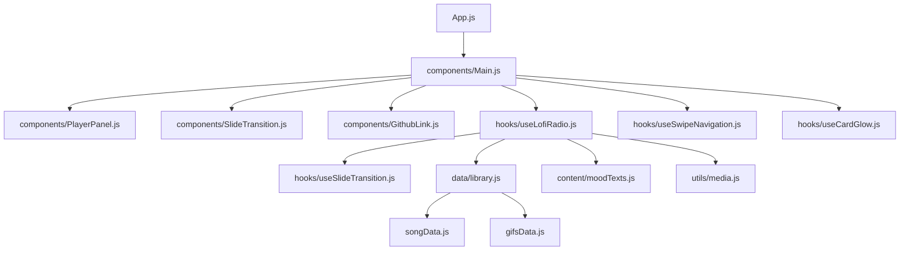

<div align="center">

# Puff Stuff Radio

An atmospheric lofi radio web app with dreamy GIF backdrops, swipe-first navigation, neon card interactions, and a rotating bank of soft motivational messages.

[](https://github.com/ARJUN300399/lofi/actions/workflows/firebase-hosting-pull-request.yml)


[Open the live app](https://puff-stuff.web.app/) | [Source code](https://github.com/ARJUN300399/lofi)

</div>

---

## Overview

Puff Stuff Radio is a small mood-first music experience built around the feeling of late-night lofi listening. The app pairs each song with a visual backdrop, lets users swipe through songs and GIFs like a short-form video feed, and keeps the interface minimal so the music and mood stay in focus.

The project started as a compact React experiment and has been refactored into a cleaner, module-based structure so it can grow into a more polished product over time.

## Highlights

- Swipe up or down to move between songs with a vertical reel-style transition.
- Swipe left or right to change the GIF while keeping the current track.
- Tap the card to trigger a short neon glow state.
- Play and skip controls are kept small and touch-friendly.
- The current song title stays prominent for emotional context.
- Mood text rotates with song and GIF changes.
- Audio URLs are normalized into raw GitHub media links before playback.
- The next track is preloaded to reduce waiting between songs.
- GIF assets are preloaded for smoother visual changes.
- GitHub Actions deploys the app automatically to Firebase Hosting.

## Live Experience

Production is hosted on Firebase:

```text
https://puff-stuff.web.app/
```

Every push to `master` runs the deployment workflow and publishes the latest build to the Firebase live channel.

## Interaction Model

| Gesture or action | Result |
| --- | --- |
| Tap play | Starts or pauses the current song |
| Tap next | Moves to the next song |
| Swipe up | Moves to the next song with an upward transition |
| Swipe down | Moves to the previous song when history is available |
| Swipe left | Changes to the next GIF |
| Swipe right | Changes to the previous GIF |
| Tap the card | Temporarily turns on the neon glow state |

## Tech Stack

| Area | Tooling |
| --- | --- |
| UI | React 18 |
| Build system | Create React App / `react-scripts` |
| Styling | Global CSS in `public/style.css` |
| Hosting | Firebase Hosting |
| CI/CD | GitHub Actions |
| Runtime data | Local song, GIF, and mood text libraries |

## Architecture

The app is intentionally split by responsibility. `Main.js` is now a composition layer, while playback, gestures, transitions, content, and utility logic live in their own modules.



## Project Structure

```text
src/
  components/
    GithubLink.js
    Main.js
    PlayerPanel.js
    SlideTransition.js
  config/
    player.js
  content/
    moodTexts.js
  data/
    library.js
  hooks/
    useCardGlow.js
    useLofiRadio.js
    useSlideTransition.js
    useSwipeNavigation.js
  utils/
    media.js
  gifsData.js
  songData.js
```

## Getting Started

### Prerequisites

- Node.js 20 is recommended because the deployment workflow uses Node 20.
- npm, included with Node.js.

### Install

```bash
npm ci
```

### Run Locally

```bash
npm start
```

The app runs at:

```text
http://localhost:3000
```

### Build

```bash
npm run build
```

The optimized production output is written to `build/`.

### Test

```bash
npm test
```

This uses the standard Create React App test runner.

## Deployment

Deployment is handled by `.github/workflows/firebase-hosting-pull-request.yml`.

The workflow:

1. Checks out the repository.
2. Sets up Node.js 20.
3. Installs dependencies with `npm ci`.
4. Builds the app with `CI=false npm run build`.
5. Deploys pull requests to Firebase preview channels.
6. Deploys pushes to `master` to the Firebase live channel.

Firebase Hosting serves the `build/` directory. The project id is configured as `puff-stuff`.

## Content Model

Songs, GIFs, and mood text are currently local data modules:

- `src/songData.js` contains the music library.
- `src/gifsData.js` contains visual backgrounds.
- `src/content/moodTexts.js` contains the rotating copy bank.
- `src/data/library.js` prepares runtime-ready data for the player.

This keeps the app easy to extend now, while leaving a clean path toward a backend, CMS, or remote content service later.

## Product Roadmap

Good next steps for turning this into a stronger product:

- Add playlists for moods like focus, romance, rain, sleep, and motivation.
- Add a lightweight favorite button for songs and GIFs.
- Add audio health checks for broken or slow media links.
- Add loading states when a song takes longer than expected.
- Add keyboard support for desktop users.
- Add analytics for skips, plays, and most-loved moods.
- Add a CMS or JSON endpoint so songs and GIFs can be updated without a code deploy.
- Add installable PWA support for mobile listening.

## Notes

The app depends on external audio and GIF URLs. If a source link expires, gets rate-limited, or becomes slow, playback can be delayed or skipped. Long term, the most reliable version of this product would use stable media hosting or a small API that validates media health before publishing it to users.

## License

No license file is currently included. Add one before allowing public reuse or contribution.
